# bdl-bscc-Cabestan
Cabestan est une application du projet MaBoxP€rf. 
Cabestan est une application du système informatique BSCC. 
Cette application est le référentiel d’offres et de produits

# Liens
* **MIS** : https://wiki.net.extra.laposte.fr/confluence/display/BGDL/MIS+CABESTAN
* **DEX** : https://wiki.net.extra.laposte.fr/confluence/display/BGDL/DEX+CABESTAN

# FlowChart

```mermaid
flowchart LR
    %% Style des tables (couleurs de remplissage, texte, bordure)
    classDef topic_ws_file  fill:#000000,color:#fff,stroke:#fff
    classDef raw            fill:#eb467d,color:#fff,stroke:#fff
    classDef bronze         fill:#a16137,color:#fff,stroke:#fff
    classDef nickel         fill:#8d389c,color:#fff,stroke:#fff
    classDef silver         fill:#8f8a86,color:#fff,stroke:#fff
    classDef chrome         fill:#ebbedc,color:#000,stroke:#000
    classDef gold           fill:#f0c04f,color:#000,stroke:#000
    classDef temp           fill:#38929c,color:#fff,stroke:#fff
    classDef work           fill:#1a6e21,color:#fff,stroke:#fff
    classDef param          fill:#ececff,color:#000,stroke:#000


    %% Variables
    %% Syntaxe d'une table non-partitionnée : my_table:::raw
    %% Syntaxe d'une table     partitionnée : my_table[[my_table]]:::raw
    d2ctaaaa.bd:::topic_ws_file
    d2rhaaaa.bd:::topic_ws_file
    d2rnaaaa.bd:::topic_ws_file

    subgraph bd_aa_rcom_raw
    r_cabestan_ct_YY_XXX:::raw
    r_cabestan_rh_YY_XXX:::raw
    r_cabestan_rn_YY_XXX:::raw
    end

    subgraph bd_aa_rcom_safe
    b_cabestan_XXX:::bronze
    b_exorcom_marche_segment_actualise:::bronze
    n_cabestan_catalogue_derniere_version:::nickel
    n_cabestan_regroupement_derniere_version_par_periode:::nickel
    n_cabestan_regroupement_derniere_version_par_periode_catalogue_derniere_version:::nickel
    n_cabestan_remise_derniere_version:::nickel
    end

    subgraph bd_aa_refcommercial_optimized
    s_rcial_regroupement_catalogue_cabestan:::silver
    s_rcial_remise_cabestan:::silver
    end

    %% Flux
    %% Syntaxe d'un flux principal  : -->
    %% Syntaxe d'un flux secondaire : -..->
    d2ctaaaa.bd                                                                         --> r_cabestan_ct_YY_XXX
    d2rhaaaa.bd                                                                         --> r_cabestan_rh_YY_XXX
    d2rnaaaa.bd                                                                         --> r_cabestan_rn_YY_XXX
    r_cabestan_ct_YY_XXX                                                                --> b_cabestan_XXX
    r_cabestan_rh_YY_XXX                                                                --> b_cabestan_XXX
    r_cabestan_rn_YY_XXX                                                                --> b_cabestan_XXX
    b_cabestan_XXX                                                                      --> n_cabestan_catalogue_derniere_version
    b_cabestan_XXX                                                                      --> n_cabestan_regroupement_derniere_version_par_periode
    b_exorcom_marche_segment_actualise                                                  --> n_cabestan_regroupement_derniere_version_par_periode
    n_cabestan_catalogue_derniere_version                                               --> n_cabestan_regroupement_derniere_version_par_periode_catalogue_derniere_version
    n_cabestan_regroupement_derniere_version_par_periode                                --> n_cabestan_regroupement_derniere_version_par_periode_catalogue_derniere_version
    b_cabestan_XXX                                                                      --> n_cabestan_remise_derniere_version
    n_cabestan_regroupement_derniere_version_par_periode_catalogue_derniere_version     --> s_rcial_regroupement_catalogue_cabestan
    n_cabestan_remise_derniere_version                                                  --> s_rcial_remise_cabestan
```

> **Légende**
> * **Trait plein** : Ce flux transporte les données principales, relatives au 'coeur de Métier' de l'application
> * **Trait pointillé** : Ce flux transporte des données secondaires, moins importantes et principalement utilisées lors jointure/union/...
> * **Doubles bordures verticales** : Cette table est partitionnée

# Historique des évolutions fonctionnelles et techniques
| Date de MEP | Version  | Jira                                                               | Description                                                                      |
|-------------|----------|--------------------------------------------------------------------|----------------------------------------------------------------------------------|
| 2023-03-21  | 02_00_00 | [BDL-664](https://jira.net.extra.laposte.fr/jira/browse/BDL-664)   | Première MEP                                                                     |
| 2023-06-06  | 02_01_00 | [BDL-1022](https://jira.net.extra.laposte.fr/jira/browse/BDL-1022) | Correction nommage tables + MVP2 Catalogue Produit_Remise + ajout MergeFile TEZ  |
| 2023-07-04  | 02_01_01 | [BDL-1119](https://jira.net.extra.laposte.fr/jira/browse/BDL-1119) | Correction RG3 du MVP 2 + exorcom + fix nommage colonnes                         |

# Notes
Pour chaque fichier, chaque type d'enregistrement a un nombre de données différent.
Toutes les lignes ayant le même type d'article sont regroupées dans une même table.

| File | YY | libellé                               | XXX                           |
|------|----|---------------------------------------|-------------------------------|
| rn   | 01 | Assiette Remise                       | assiette_remise               |
| rn   | 02 | Critère                               | crit                          |
| rn   | 03 | Nature Critère                        | nat_crit                      |
| rn   | 04 | Type Critère                          | type_crit                     |
| rn   | 05 | Type Entité                           | type_entite                   |
| rn   | 06 | Type Tarif                            | type_tarif                    |
| rn   | 07 | Unité Remise                          | unit_remise                   |
| rn   | 08 | Type imputation Comptable             | type_imput_comptable          |
| rn   | 38 | Valeur Critère Liste Référence        | val_crit_lst_ref              |
| rn   | 47 | Type Filtre                           | type_filtre                   |
| rn   | 48 | Type imputation Comptable EQUINOX     | type_imput_comptable_equinox  |
| rh   | 9  | catégorie                             | categorie                     |
| rh   | 10 | Code TVA                              | code_tva                      |
| rh   | 11 | Imputation Comptable                  | imput_comptable               |
| rh   | 12 | Mode Affranchissement                 | mode_aff                      |
| rh   | 13 | Niveau Priorité remise                | niv_prio_remise               |
| rh   | 14 | Taux TVA                              | tx_tva                        |
| rh   | 15 | Type Concurrence                      | type_concurrence              |
| rh   | 16 | Type Filiale                          | type_filiale                  |
| rh   | 17 | Type Regroupement                     | type_regroupement             |
| rh   | 18 | Zone Dépôt                            | zone_depot                    |
| rh   | 39 | groupe Remise                         | groupe_remise                 |
| rh   | 40 | Moif Déclassement                     | motif_declassement            |
| rh   | 49 | Valeur Filtre                         | val_filtre                    |
| rh   | 50 | Imputation Comptable Equinox          | imput_comptable_equinox       |
| rh   | 52 | Zone destination                      | zone_dest                     |
| rh   | 53 | Zone emplacement                      | zone_emplacement              |
| rh   | 54 | Règle Fiscale                         | regle_fiscale                 |
| ct   | 19 | Article                               | article                       |
| ct   | 20 | Article - Valeur Critère              | crit_article                  |
| ct   | 21 | Message                               | msg                           |
| ct   | 22 | Produit Filiale                       | pdt_filiale                   |
| ct   | 23 | Rattachement Produit Filiale          | assos_pdt_filiale             |
| ct   | 24 | Rattachement Remise                   | assos_remise                  |
| ct   | 25 | Sous-Produit - Critère                | ss_pdt_crit                   |
| ct   | 26 | Valeur Critère                        | val_crit                      |
| ct   | 27 | Version Eléments de gestion           | ver_element_gestion           |
| ct   | 28 | Version Famille                       | ver_famille                   |
| ct   | 29 | Version Gamme                         | ver_gamme                     |
| ct   | 30 | Version Produit/Service               | ver_pdt_service               |
| ct   | 31 | Version Produit/Service - Famille     | ver_pdt_service_famille       |
| ct   | 32 | Version Remise                        | ver_remise                    |
| ct   | 33 | Version Services - Sous-Produit       | ver_service_ss_pdt            |
| ct   | 34 | Version Sous-Produit                  | ver_ss_pdt                    |
| ct   | 35 | Version Sous-Produit - Article        | ver_ss_pdt_art                |
| ct   | 36 | Version Sous-Produit - Valeur Critère | ver_ss_pdt_val_crit           |
| ct   | 37 | Version Tarif                         | ver_tarif                     |
| ct   | 41 | Déclassement                          | declassement                  |
| ct   | 42 | Article Hors Option                   | art_hors_opt                  |
| ct   | 43 | Article Offre Presse                  | art_offre_presse              |
| ct   | 44 | Rattachement DAPO                     | assos_dapo                    |
| ct   | 51 | Article – Valeur de Filtre            | art_val_filtre                |

* 3.8. Chargement du safe et 3.9 optimized : il est noté qu'il faut vider puis charger les tables à la condition qu'il y ait des données. Or actuellement aucun contrôle n'est fait. On vide systématiquement et s'il n'y a rien a charger la table reste vide. Après cabestan c'est du one shot, est-ce qu'on doit etre iso avec ce qu'on nous envoie ou bien il faut respecter la regle de gestion mentionné en 3.8 et 3.9 ? --> pour le moment on est iso, si besoin de faire de l'optim' on verra plus tard.

# TODO List
* Finir de mettre à jour le Wiki
* Si les chargements sont trop long (dû à la taille du fichier common.properties) -> sinder le projet en 3 : cabestan_ct, cabestan_rh et cabestan_rn
* alim catalogue produit : la condition sur la date debut des familles n'est pas prises en compte (à ajouter ligne 103 : WHERE (date_deb_ver >= '2012-01-01' OR (date_deb_ver < '2012-01-01' AND date_arret_famille is null))) -> la variable existant pourtant déjà : app.ddvf
